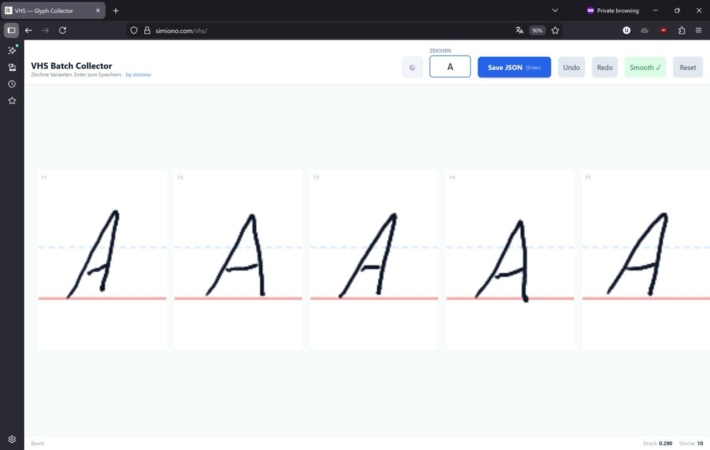

# Vector Handwriting System (VHS)

**🌐 Live Demo:** [utrost.github.io/VHS](https://utrost.github.io/VHS/) · [simiono.com/vhs](https://simiono.com/vhs/)

VHS is a deterministic pipeline for generating realistic handwriting for pen plotters. It replaces neural-network-based generation with a stochastic "Shaping Engine" utilizing a custom-captured library of single-stroke vector glyphs.

## Project Structure

- **`GlyphCollectorUI/`**: A browser-based tool for capturing handwriting glyph variants.
- **`assembler/`**: Python tools to assemble captured glyphs into handwritten SVG text.
- **`glyphs/`**: Storage for captured glyph data (JSON format). Personal glyph data is gitignored.
- **`vhs-cli.*` / `vhs-gui.*`**: Platform-specific scripts to run the CLI and Web UI from the root.



### Example Output


*Generated SVG output — single-stroke paths ready for pen plotting.*

## Quick Start

### 1. Capture Glyphs
1. Open `GlyphCollectorUI/GlyphCollectorUI.html` in a browser (or use the [live version](https://simiono.com/vhs/)).
2. Enter a character in the input field.
3. Draw 10 variants across the canvas slots. Use a stylus/tablet for pressure sensitivity.
4. Press **Enter** or click **Save JSON** to export.
5. Move the JSON files to `glyphs/YourFont/`.

**Capture aids** (toggle in header bar or via keyboard):
- **Template** (`T`) — Semi-transparent handwriting font overlay as a visual guide. Pick from 17 Google Fonts in ⚙️ Settings. Adjust opacity (default 15%).
- **Bezier** (`B`) — Fits cubic Bezier curves to your strokes in real-time. Produces smoother SVG output. Adjust tolerance in Settings (0.5–5.0).
- **Normalize** (`N`) — Corrects slant, normalizes height, and smooths pressure. Keeps your handwriting character but cleans up wobbles. Start with low strength (25%) and increase as needed.
- **Smooth** — Catmull-Rom spline preview (on by default).

All processing is display-only — raw stroke data is always preserved. When Bezier or Normalize are active during Save, the enhanced data is included in the JSON and used by the Assembler automatically.

### 2. Generate Handwriting (CLI)

Use the provided start scripts for your platform:

**macOS/Linux:**
```bash
./vhs-cli.sh "Hello World" output.svg --font YourFont
./vhs-cli.sh --file letter.txt output.svg --font YourFont \
  --paper-size A4 --margin 25 --line-height-mm 8 --line-spacing 1.3 --stroke-width 0.4
```

**Windows:**
```cmd
vhs-cli.bat "Hello World" output.svg --font YourFont
vhs-cli.bat --file letter.txt output.svg --font YourFont ^
  --paper-size A4 --margin 25 --line-height-mm 8 --line-spacing 1.3 --stroke-width 0.4
```

All page-related values (`--line-height-mm`, `--margin`, `--start-x/y`, `--max-width-mm`, `--stroke-width`) are in **millimetres**, so the output matches real paper. See [`docs/USER_GUIDE.md`](docs/USER_GUIDE.md) for the full walkthrough.

### 3. Web UI

**macOS/Linux:**
```bash
./vhs-gui.sh
```

**Windows:**
```cmd
vhs-gui.bat
```

Open [http://localhost:5001](http://localhost:5001) in your browser.

The web UI provides a modern visual interface with live SVG preview, file upload, paper size presets, and real-time adjustment of all assembler parameters.

## Features

- **True Single-Stroke**: Output paths are 1-pixel wide vectors — ready for pen plotters.
- **Bezier Curve Fitting**: Schneider algorithm with adaptive corner detection and Newton-Raphson refinement converts raw polyline captures into smooth cubic Bezier curves. Produces cleaner SVG output with fewer path points and natural curvature.
- **Stroke Normalization**: Captured strokes are automatically corrected for slant, smoothed for pressure variation, and height-normalized for consistent glyph sizing. Blending strength is configurable.
- **Template Overlay**: Semi-transparent handwriting font guides behind the capture canvas slots. Choose from 17 Google Fonts organized in two groups (Formal and Casual) to guide your capture consistency.
- **Millimetre-First Page Layout**: Every page-related control (`--line-height-mm`, `--margin`, `--start-x/y`, `--max-width-mm`, `--stroke-width`) is in millimetres. A 12 mm line on paper stays 12 mm regardless of how much text you feed it — the Assembler does not auto-shrink to fit, so you keep pixel-perfect control.
- **Fixed Paper Sizes**: Support for A3, A4, A5, A6, Letter, and Legal with Portrait/Landscape orientation.
- **Micro-Variations**: Randomly selects from multiple variants of each character to avoid the "font" look.
- **Curve Smoothing**: Catmull-Rom splines turn raw input into fluid, natural curves (fallback when Bezier data is unavailable).
- **Zone-Aware Auto-Kerning**: Scanline-based algorithm calculates optimal letter spacing with vertical zone awareness (upper/ground/lower). Letters in non-overlapping zones kern tighter. Configurable aggressiveness (0.0–1.0).
- **Ligature Support**: Greedy matching for multi-character sequences (e.g., "sch", "tt", "th").
- **Typography Controls**: Line height in mm (or derived from `--lines-per-page`), line spacing multiplier, explicit text-block origin, page margins, and mm-based word wrapping via `--max-width-mm`.
- **Balanced Line Breaks**: Default `--wrap-mode balanced` runs a minimum-raggedness DP per paragraph so line lengths stay uniform; `--wrap-mode greedy` falls back to first-fit. `--space-width-mm` and `--space-jitter-mm` give human-sized spaces with subtle variation.
- **Organic Line Drift**: `--line-drift-angle` and `--line-drift-y` apply a tiny per-line rotation and baseline wobble so the output doesn't look like it's sitting on ruled lines.
- **Multi-Page Pagination**: `--paginate` splits content that overflows into `output-01.svg`, `output-02.svg`, ….
- **Pressure Data**: Preserves pressure information from the capture phase. Bezier segments carry interpolated pressure from raw stroke points.
- **Multi-Font**: Organize different handwriting styles in separate `glyphs/` subdirectories.
- **Windows Safe**: Unicode hex filenames (e.g., `0041.json`) prevent case-insensitivity conflicts.

## Assembler Pipeline

The assembler uses a priority chain when rendering glyphs:

1. **Bezier curves** (`bezier_curves` in JSON) — rendered as SVG cubic Bezier `C` commands for the smoothest output
2. **Normalized strokes** (`normalized_strokes` in JSON) — slant-corrected, pressure-smoothed, height-normalized points
3. **Raw points** (`strokes` in JSON) — original capture data, optionally smoothed with Catmull-Rom splines

Use `--no-bezier` to skip Bezier curves and fall back to normalized/raw strokes. Use `--no-normalize` to skip normalized strokes and use raw points directly. Both flags can be combined.

```bash
./vhs-cli.sh "Hello" output.svg --font MyFont --no-bezier        # skip Bezier, use normalized or raw
./vhs-cli.sh "Hello" output.svg --font MyFont --no-normalize      # skip normalization, use Bezier or raw
./vhs-cli.sh "Hello" output.svg --font MyFont --no-bezier --no-normalize  # raw points only
```

## Testing

The system includes a comprehensive automated test suite:
- **Unit Tests**: 24 tests covering the core engine logic (kerning, zone-aware kerning, ligatures, metrics, Bezier path generation, normalized strokes, fallback chains, backward compatibility).
- **CLI Tests**: 30 tests verifying the command-line interface, including paper sizes, margins, kerning aggressiveness, deterministic jitter, and error handling.

Run all tests:
```bash
cd assembler
python3 -m unittest test_assembler test_cli -v
```

## Documentation

- [User Guide](docs/USER_GUIDE.md) — Full mm-first layout walkthrough with recipes and cheat-sheet (start here)
- [Roadmap](docs/ROADMAP.md) — Planned realism and UX enhancements
- [How to Create Realistic Handwriting](HowTo.md) — Step-by-step capture guide
- [Assembler Reference](assembler/README.md) — CLI flag table, kerning, ligatures
- [Glyph Collector UI](GlyphCollectorUI/README.md) — Capture tool documentation
- [Technical Design Document](Handwriting%20Simulation%20System%20TDD.md) — Architecture and data specification

## Requirements

- Python 3.10+
- Modern web browser (for Capture UI)
- A pen plotter (for the fun part)

## License

Copyright © 2025–2026 Uwe Trostheide

Licensed under the [GNU Affero General Public License v3.0](LICENSE).

Note: The VHS engine is open source. Your captured glyph data (your handwriting) is yours — keep it private or share it, your choice.
