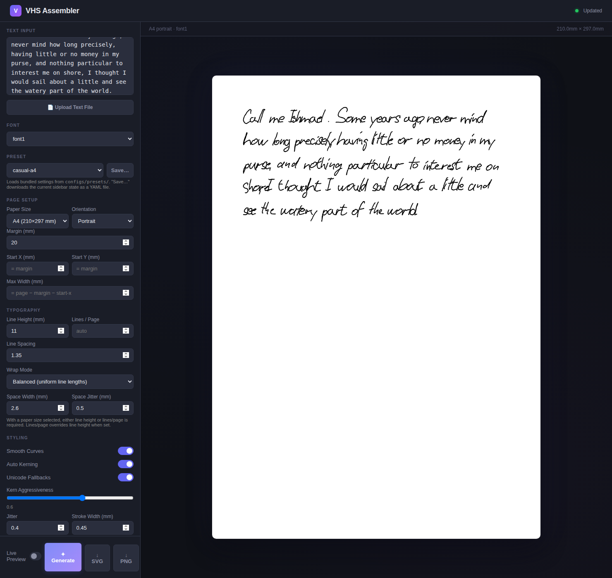
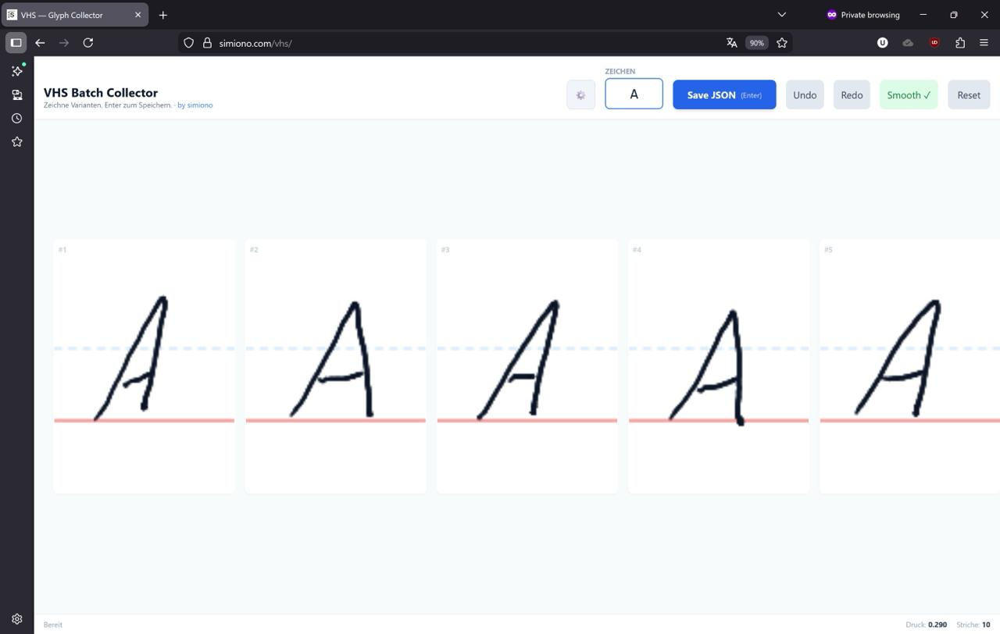
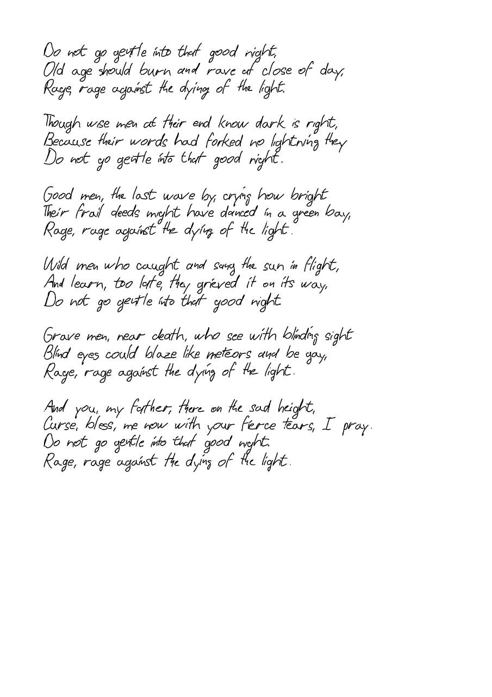

# VHS

VHS turns typed text into handwriting-style SVG for pen plotters.

You draw your own glyphs with a pen, tablet, or stylus. Capture a few versions of each letter, digit, punctuation mark, or ligature. VHS then uses those glyphs to assemble text as single-stroke vector paths.

The output is meant for plotters: SVG paths, millimetre-based page settings, paper sizes, margins, line spacing, and small variation so repeated letters do not all look the same.

## What you can do

- Capture handwriting glyph variants in the browser.
- Turn text or a text file into SVG.
- Export PNG or PDF when the optional dependencies are installed.
- Use A3, A4, A5, A6, Letter, or Legal page sizes.
- Set margins, line height, stroke width, wrapping, spacing, and line drift.
- Keep your handwriting data local. Glyph JSON files are yours to keep private or share.

## Try it

There are two ways to start.

### 1. Capture glyphs online

Use the hosted collector demo:

- https://simiono.com/vhs/
- https://utrost.github.io/VHS/

This is collector-only. It lets you draw glyphs and download JSON files. It does not assemble full pages in the browser.

### 2. Run the local app

The local app has the full workflow: capture glyphs, type text, preview SVG, and export files.

You need Python 3.10 or newer.

macOS / Linux:

```bash
./vhs-gui.sh
```

Windows:

```cmd
vhs-gui.bat
```

The first run creates a local `.venv`, installs the needed packages, starts the server, and opens the app at:

```text
http://localhost:5001
```

By default it only listens on `localhost`.

## Basic workflow

1. Open the local app.
2. Go to **Capture glyphs**.
3. Pick a character, for example `a`.
4. Draw several versions with a pen or tablet.
5. Save the glyph JSON into a font folder.
6. Go back to **Assemble**.
7. Type or paste text.
8. Adjust page size, margins, line height, spacing, and stroke width.
9. Export SVG and send it to your plotter workflow.

You do not need to capture a full alphabet before testing. Start with a small phrase and the characters it needs.

## Command line

Generate an SVG from text:

```bash
./vhs-cli.sh "Hello World" output.svg --font font1
```

Generate an SVG from a text file:

```bash
./vhs-cli.sh --file letter.txt output.svg --font font1 \
  --paper-size A4 \
  --margin 25 \
  --line-height-mm 8 \
  --line-spacing 1.3 \
  --stroke-width 0.4
```

On Windows, use `vhs-cli.bat` instead of `./vhs-cli.sh`.

## Fonts and glyphs

A VHS font is a folder of JSON files under `glyphs/`.

Each JSON file stores captured strokes for one character or ligature. VHS picks from the available variants while assembling text. More variants usually means less repetition on the page.

The repository includes `glyphs/font1` as a sample font so you can test the assembler before drawing your own alphabet.

## Screenshots







## Notes for plotter use

- The main output is SVG with stroked paths.
- Page and spacing controls use millimetres.
- The paths are intended for pen plotting, not filled font outlines.
- Test with a short phrase first. Check scale, stroke width, and spacing before plotting a full page.
- Different plotter software handles SVG slightly differently. If something imports badly, try saving a smaller sample and inspect the paths first.

## Documentation

- [User guide](docs/USER_GUIDE.md)
- [Assembler GUI guide](docs/GUIDE_ASSEMBLER_GUI.md)
- [Assembler CLI guide](docs/GUIDE_ASSEMBLER_CLI.md)
- [Glyph collector guide](docs/GUIDE_GLYPHCOLLECTOR.md)
- [Roadmap](docs/ROADMAP.md)
- [Contributing](CONTRIBUTING.md)

Tracer has moved to a separate project: [utrost/Tracer](https://github.com/utrost/Tracer).

## License

VHS is licensed under the [GNU Affero General Public License v3.0](LICENSE).
