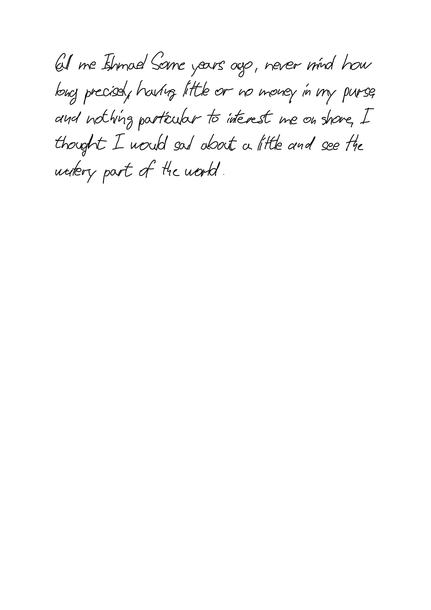
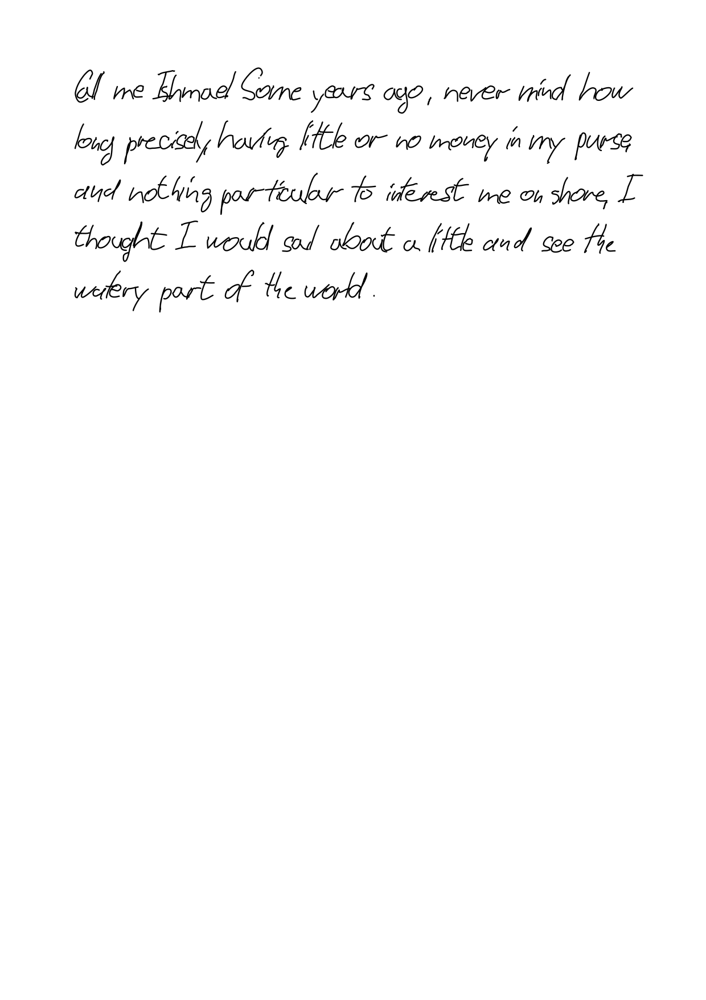
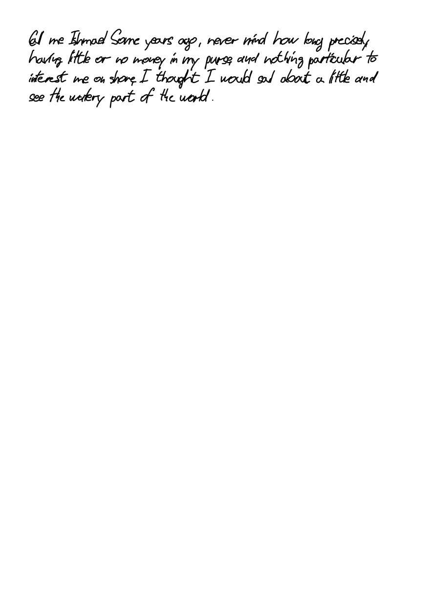

# VHS Assembler — CLI Guide

A walkthrough of the `assembler/assembler.py` command-line tool, with
end-to-end recipes and real rendered samples. Every image in this guide
was produced by the CLI itself.

> See [`docs/USER_GUIDE.md`](USER_GUIDE.md) for the full flag reference
> and the mm-based layout model. This guide focuses on *doing things*.

---

## 1. Install

```bash
pip install pyyaml cairosvg pypdf       # pyyaml for --config / --preset,
                                        # cairosvg + pypdf for PNG / PDF
```

Only `pyyaml` is required for the built-in presets; `cairosvg` unlocks
`--format png`; `pypdf` unlocks `--format pdf`. The plain SVG path has
no third-party dependencies.

---

## 2. The fastest useful command

```bash
python3 assembler/assembler.py \
    --preset letter-a4 \
    --font font1 \
    --seed 42 \
    -f /tmp/moby.txt \
    output/letter.svg
```

That loads the bundled `letter-a4` preset (A4 paper, 10 mm line height,
subtle organic jitter, auto-kern, 0.4 mm stroke), renders the text file,
and writes `output/letter.svg`.

**Result:**



---

## 3. Swap presets, keep everything else

```bash
python3 assembler/assembler.py --preset casual-a4 --font font1 \
    --seed 42 -f /tmp/moby.txt output/casual.svg
```

Looser hand, bigger line drift and per-glyph jitter:



```bash
python3 assembler/assembler.py --preset notebook-page --font font1 \
    --seed 42 -f /tmp/moby.txt output/notebook.svg
```

Tight 6 mm lines, minimal drift (as if writing against a ruler):



---

## 4. Override preset values on the command line

Presets set defaults. CLI flags always win. Start from `letter-a4` but
switch to A5 portrait, tighter kerning, no auto-kern:

```bash
python3 assembler/assembler.py \
    --preset letter-a4 \
    --paper-size A5 --orientation portrait --margin 12 \
    --no-fallbacks \
    --font font1 \
    -f /tmp/moby.txt output/letter-a5.svg
```

Precedence is explicit in `docs/ROADMAP.md` and re-stated here for
reference:

> per-font preset (`glyphs/<font>/preset.yaml`)
>   < `--preset NAME`
>   < `--config PATH`
>   < CLI flags

---

## 5. Dry-run a layout before you commit (`--report`)

Tuning `--line-height-mm` or `--lines-per-page` on a long file is
painful if each attempt takes a full render. `--report` typesets but
skips SVG emission and prints a structured summary instead:

```bash
python3 assembler/assembler.py --preset letter-a4 --font font1 \
    --report -f /tmp/moby.txt output/ignored.svg
```

Sample output:

```
--- Layout report ---
Page: A4 portrait (210.0×297.0 mm), margin 25 mm
Layout: line 10.00 mm × spacing 1.30 → advance 13.00 mm,
        origin (25.0,25.0) mm, wrap 160.0 mm
Content: 43 words, 5 lines, 65.0 mm tall
Fits: 1 page(s) (19 lines × 13.00 mm per page)
Coverage: all characters covered
```

Machine-readable form:

```bash
python3 assembler/assembler.py --preset letter-a4 --font font1 \
    --report --report-format json -f /tmp/moby.txt output/ignored.svg
```

`--strict-glyphs` flips uncovered codepoints into a fatal error (exit
code `2`) so you can gate CI on coverage.

---

## 6. Coverage and Unicode fallbacks

Hand-drawn fonts rarely cover em-dashes, curly quotes, ellipsis, NBSP.
By default the Assembler substitutes them and prints a coverage banner:

```
Glyph coverage:
  substituted: '—'→'--' ×3, '…'→'...' ×1
  missing "'" ×1  e.g. "…cking people's hats off--…"
```

Pass `--no-fallbacks` to keep the original bytes (and see the misses
explicitly). Pass `--strict-glyphs` to refuse to render when anything
remains uncovered.

---

## 7. PNG and PDF output

```bash
python3 assembler/assembler.py --preset letter-a4 --font font1 \
    --format png --dpi 300 \
    "Hello, world." output/hello.png
```

Writes both `output/hello.svg` (intermediate) and `output/hello.png`.
`--transparent` gives a transparent background.

```bash
python3 assembler/assembler.py --preset letter-a4 --font font1 \
    --paginate --format pdf \
    -f /tmp/novel.txt output/novel.pdf
```

Produces `novel-01.svg`, `novel-02.svg`, … plus a single multi-page
`novel.pdf` combining them.

---

## 8. Pagination with widow / orphan control

`--paginate` splits content across pages. `--min-orphan-lines` and
`--min-widow-lines` (both default `2`) shift break points so
paragraphs don't leave single-line stragglers:

```bash
python3 assembler/assembler.py --preset letter-a4 --font font1 \
    --paginate \
    --min-orphan-lines 2 --min-widow-lines 2 \
    -f /tmp/long.txt output/long.svg
```

Set either to `1` to disable its rule. The CLI log appends
`(adjusted for widows/orphans)` when a shift landed.

---

## 9. Custom recipes via `--config`

When you want a one-off tweak beyond a bundled preset, drop the values
into YAML:

```yaml
# /tmp/my.yaml
paper_size: A6
orientation: portrait
margin: 5
line_height_mm: 5
stroke_width: 0.3
glyph_slant_jitter: 0.4
```

```bash
python3 assembler/assembler.py --config /tmp/my.yaml --font font1 \
    "tiny note" output/tiny.svg
```

CLI flags still override anything in the file.

---

## 10. Multiple text frames (`--frames`)

Sometimes one page needs more than one independently-positioned block —
a heading box plus a body column, a margin note, two columns. Describe
each block in a JSON file and pass it with `--frames`:

```json
{
  "frames": [
    { "text": "Reisetagebuch",
      "start_x": 20, "start_y": 20, "max_width": 120 },
    { "text": "Heute war ein ruhiger Morgen. Ich sass lange am Fenster.",
      "start_x": 20, "start_y": 45, "max_width": 100 },
    { "text": "Notiz am Rand",
      "start_x": 130, "start_y": 45, "max_width": 60 }
  ]
}
```

```bash
python3 assembler/assembler.py --frames frames.json output/page.svg \
    --font font1 --paper-size A4 --margin 15 --line-height-mm 7 --seed 42
```

Each frame field is in millimetres: `text` (required), `start_x`,
`start_y`, `max_width` (these default to the margin / page width, exactly
like the single-block flags). Every frame wraps to its own `max_width`
column. A bare top-level JSON array works too (the `{"frames": [...]}`
wrapper is optional).

Notes:

- `--frames` **requires `--paper-size`** (positions are mm) and is
  mutually exclusive with the positional text / `--file`.
- Global options — font, line height, spacing, colour, realism, stroke —
  apply to all frames. (Per-frame typography is a possible future
  extension.)
- Works with `--format png` / `--format pdf`. Not combinable with
  `--paginate` (a frame layout is one positioned page).
- `--report` gives a **per-frame** fit summary (words, lines, content vs
  available height, and an overflow flag) instead of rendering — add
  `--report-format json` for a machine-readable version.
- The web GUI's **➕ Frame** mode (GUI guide §6) builds and sends exactly
  this structure, so a layout designed on the page is reproducible here.

---

## 11. How to refresh the screenshots in this guide

The PNGs in `docs/img/cli-*.png` are produced by
`docs/tools/capture_screenshots.py`. Re-run it after a visible CLI
change to keep the guide accurate:

```bash
python3 docs/tools/capture_screenshots.py
```

The script uses the `font1` font and `--seed 42` so successive runs
produce byte-identical PNGs unless the rendering pipeline itself
changed.
