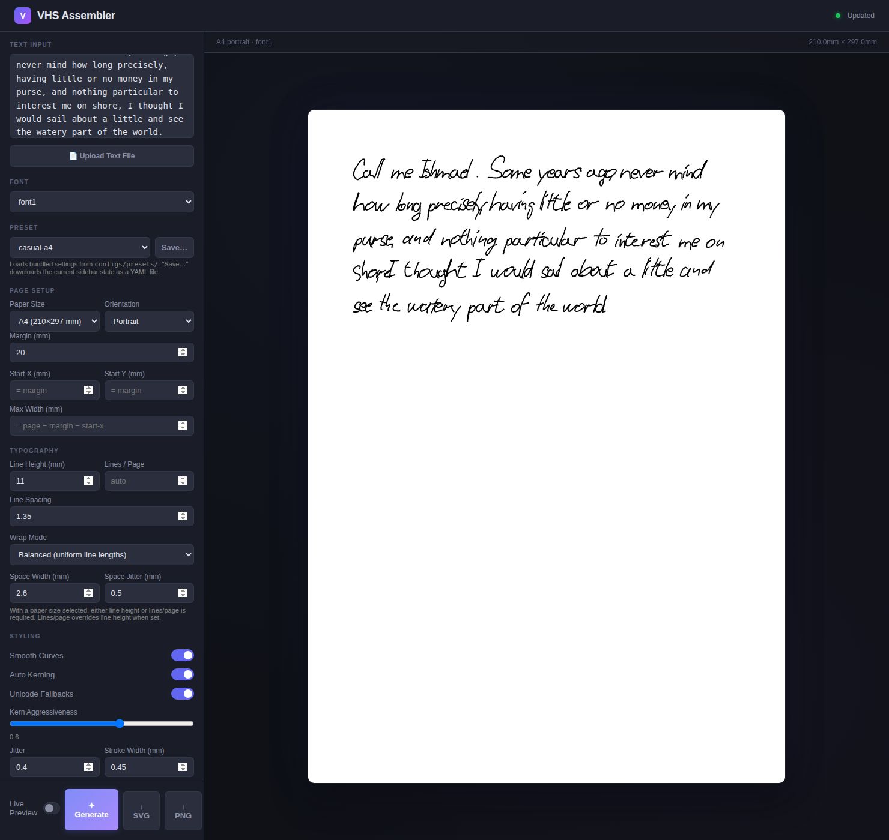
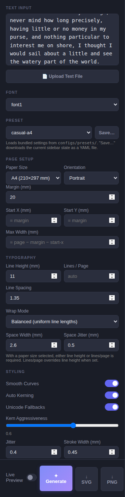
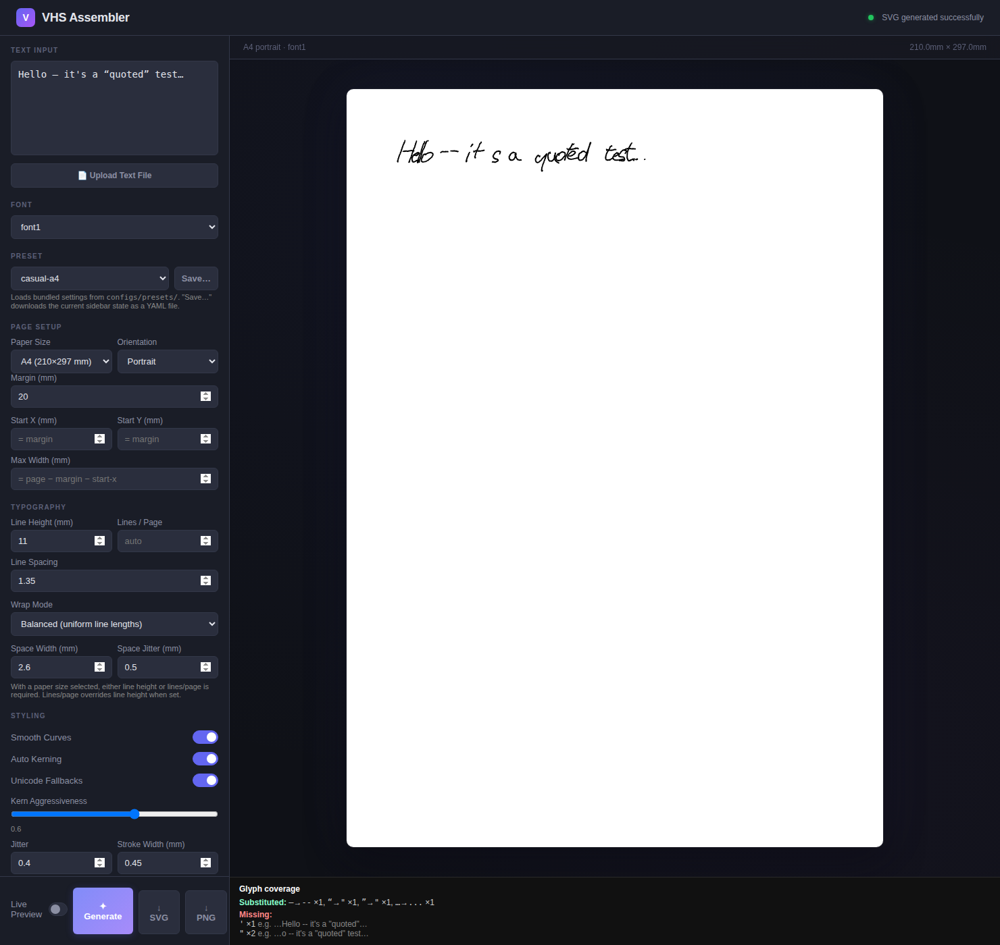

# VHS Assembler — Web GUI Guide

A walkthrough of the browser UI at `http://localhost:5001`. Every
knob in the sidebar has a matching CLI flag; start here when you want
to see changes as you make them.

> Start the server with `./vhs-gui.sh` (or `python3 assembler/server.py`)
> and open [http://localhost:5001](http://localhost:5001).

---

## 1. The layout



The sidebar is divided into sections that mirror the flag groups in the
CLI guide:

- **Text / Font** — text input, font family, file upload.
- **Preset** — bundled recipes (see `docs/USER_GUIDE.md` §4) with a
  **Save…** button that exports the current sidebar state as YAML.
- **Page Setup** — paper size, orientation, margin, explicit start-x /
  start-y, max-width (all mm).
- **Typography** — line height mm (or lines/page), spacing, wrap mode,
  space width and jitter.
- **Styling** — smoothing, auto-kern, fallbacks, jitter, stroke width,
  ink colour, line drift, per-glyph jitter.
- **Sidebar actions** — live-preview toggle, Generate, and SVG / PNG /
  PDF download buttons.

The right-hand **preview** area shows the currently rendered SVG and
updates live as you change controls.

---

## 2. Live preview



With the **Live Preview** toggle on (default), any change to a control
triggers a fresh render 350 ms after the last input. Superseded
requests are cancelled so stale renders never overwrite fresh ones.
The server caches loaded glyph libraries across requests, so steady-
state updates are ~20× faster than a cold render.

Disable the toggle to fall back to click-to-generate when you want to
batch changes.

---

## 3. Presets

The **Preset** dropdown loads a bundled recipe from
`configs/presets/`:

| Preset | What it is |
|---|---|
| `letter-a4` | Formal A4 letter, 10 mm lines, subtle organic jitter. |
| `letter-a5` | Note-sized A5, 8 mm lines. |
| `notebook-page` | Compact ruled-paper feel, 6 mm lines. |
| `casual-a4` | Looser handwriting, bigger drift + per-glyph jitter. |
| `architects-a3` | Landscape A3 drafting-style capitals, 15 mm lines. |

The **Save…** button prompts for a filename and downloads the current
sidebar state as a YAML file you can drop into `configs/presets/` (or
pass to `--config`). CLI and GUI share the same preset format.

---

## 4. The Coverage panel



When the rendered text contains characters the font doesn't cover, a
**Glyph coverage** panel appears beneath the preview:

- **Substituted** — codepoints replaced by the Unicode fallback map
  (em-dash → `--`, curly quotes → straight, ellipsis → `...`, …). Each
  entry shows the original → replacement and the count.
- **Missing** — codepoints neither the font nor the fallback map
  covered. Each entry shows a short snippet from the source text so you
  can find the offending character.

The panel stays hidden while the text is fully covered. Disable the
fallback pass with the **Unicode Fallbacks** toggle in the Styling
section — handy when you want to see exactly which characters your
font is missing.

---

## 5. Exporting

- **SVG** — always available. The vector original, ready for pen
  plotters or lossless printing.
- **PNG** — requires `cairosvg`. Uses the **PNG DPI** field (default
  300) and the **transparent** checkbox.
- **PDF** — requires `cairosvg` + `pypdf`. Exports the current preview
  as a one-page PDF. Multi-page PDFs come from the CLI's `--paginate
  --format pdf` combination.

---

## 6. CLI / GUI parity

Every non-paginate flag has a matching GUI field. The only documented
CLI-only features are:

- `--paginate` (the GUI shows a single preview).
- `--report` and `--report-format` (output is a text / JSON dump,
  not a rendered file).
- `--strict-glyphs` (CI gate — same reason).

When a new flag lands on the CLI, a matching GUI input lands in the
same pull request. See `docs/ROADMAP.md` → *Ground rules*.

---

## 7. How to refresh the screenshots in this guide

Screenshots in this guide are captured by
`docs/tools/capture_screenshots.py`. Start the server in one terminal,
then run the script in another:

```bash
./vhs-gui.sh
# in a second terminal
python3 docs/tools/capture_screenshots.py
```

Images land in `docs/img/`. The script uses seeded sample text so
repeated runs produce visually identical shots unless the UI itself
changed.
