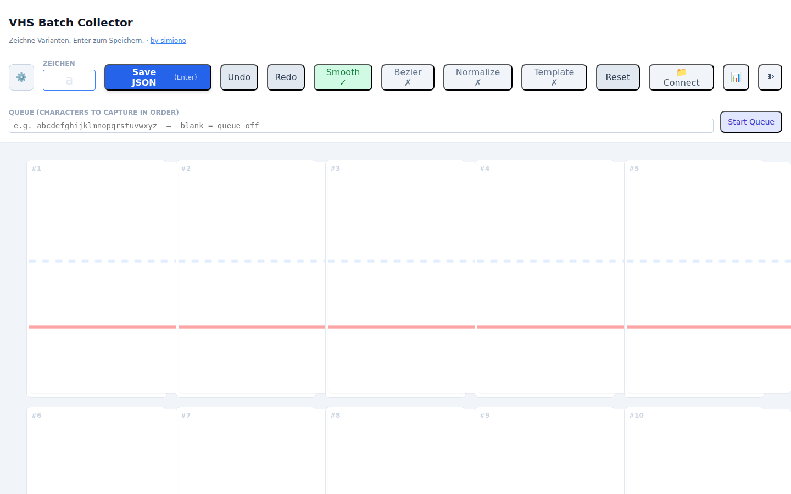
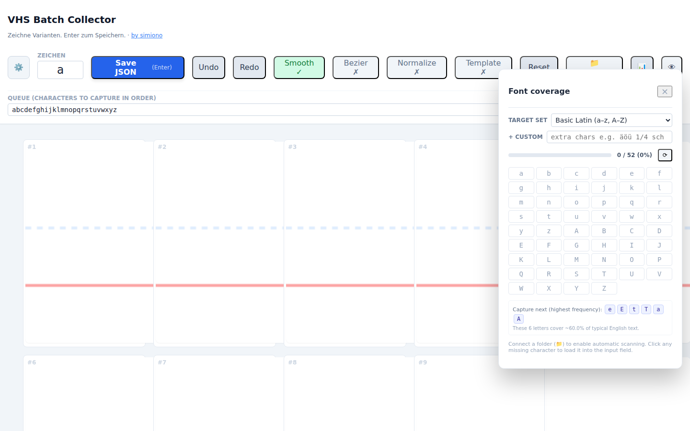

# VHS GlyphCollector — Capture Guide

A walkthrough of `GlyphCollectorUI/GlyphCollectorUI.html`, the
browser-based tool for capturing handwriting glyph variants. Covers
the workflow from an empty grid to a usable font.

---

## 1. Open the Collector

Two ways to launch:

- **Via the Assembler server** (recommended — unlocks the Assembler
  live-preview panel):
  ```bash
  ./vhs-gui.sh        # or python3 assembler/server.py
  # open http://localhost:5001/collector
  ```
- **As a static file** — open
  `GlyphCollectorUI/GlyphCollectorUI.html` directly in a Chromium-family
  browser. The live preview (👁) needs the server, but everything else
  works.



The header packs the full toolchain into one row: settings (⚙️),
character label input, Save/Undo/Redo, feature toggles (Smooth,
Bezier, Normalize, Template), Reset, **📁 Connect** (folder save),
**📊** (coverage dashboard), **👁** (Assembler preview). The grid
underneath holds the variant canvases.

---

## 2. Connect a folder (recommended)

Click **📁 Connect** and point the picker at the folder you want to
capture into — typically `glyphs/YourFont/`. The button turns green
and shows the folder name.

With a folder connected:

- Save writes `<label>.json` directly into it. No download-and-move
  shuffle.
- The coverage dashboard can auto-scan to show which characters you
  already have.
- Typing a label that matches an existing file triggers a **Load for
  editing** prompt.

Firefox and Safari don't implement the File System Access API yet —
the button is still visible but saves will fall back to per-file
downloads. Chrome, Edge, and Opera are the supported connect path.

---

## 3. Queue capture mode

Type a sequence into the **Queue** field (whitespace or comma-
separated). Click **Start Queue**.


- The first token loads into the **Zeichen** (label) input.
- Draw your variants.
- Hit **Enter** (or click *Save JSON*). The file is written, the grid
  clears, and the next token auto-loads.
- A progress readout shows `done / total · next: x`.
- **Esc** stops the queue. The queue also exits automatically when
  the last token saves.

Multi-character tokens work — useful for ligatures like `sch, tt, ff`.

---

## 4. The coverage dashboard



Click **📊** to open the dashboard. Controls:

- **Target set** — pick a bundled character list (Basic Latin,
  Numbers, Basic punctuation, German umlauts, Full ASCII printable).
- **+ Custom** — extra characters appended to the target (dedup'd).
- **Progress bar** — `captured / total (pct%)`.
- **Grid** — green cells are captured, grey are missing. Hover any
  cell for its variant count; click any cell to load that character
  into the input.
- **Capture next** — a row ranked by English letter frequency that
  highlights the highest-impact uncaptured letters. The chip labels
  are clickable.

Selections (preset + custom text) persist to `localStorage` per
font, so reopening a project picks up where you left off.

---

## 5. Drawing discipline

Use a stylus for pressure sensitivity — mouse-drawn strokes register
a flat 0.5 pressure. The red baseline and blue dashed x-height are
your guides:

- **Ascenders** (b, d, f, h, k, l, t, …) should rise above the blue
  line.
- **Descenders** (g, j, p, q, y) should dip below the red line.
- **Mid-zone** characters (a, c, e, …) stay between the two.

On **Save**, the Collector validates each variant against a simple
zone rule table. If a `g` has no descender or an `h` has no ascender,
a confirm dialog lists the offending variants and lets you save
anyway or go back and fix them.

---

## 6. Per-variant adjustments

- **✕ button** — every slot has a clear ✕ on hover that wipes only
  that variant, leaving the others untouched. No more "one wobble,
  redraw the whole character".
- **Shift-click on a slot** — sets that slot's baseline to the click
  y. The guide lines turn orange to show the override.
- **Alt-click on a slot** — same for the x-height.

Per-slot baseline / x-height overrides are saved as variant
`metadata` in the JSON.

---

## 7. Live Assembler preview

Click **👁** to open the preview panel. The Collector calls the
Assembler's `/api/generate` endpoint using the currently-saved glyphs
in the connected folder and renders a sample sentence. The preview
refreshes automatically after every save, so you immediately see
whether a new variant fits with the rest of your font.

This feature needs the Assembler server running (`./vhs-gui.sh`) and
works best when the Collector is opened via
`http://localhost:5001/collector`. Cross-origin requests from
`file://` are permitted (CORS is open on the local server) but
some browsers still block mixed content — if preview fails, open the
Collector through the server URL.

---

## 8. Suggested workflow: capture a font in one sitting

1. **📁 Connect** → point at `glyphs/MyFont/`.
2. **📊** → pick *Basic Latin* (or start with the frequency-ranked
   top chars shown under **Capture next**).
3. Type `abcdefghijklmnopqrstuvwxyz` into the **Queue** field → click
   **Start Queue**.
4. Draw 5–10 variants of each letter. Watch the pressure indicator —
   consistent contact helps the Bezier fitter.
5. Press **Enter** after each letter. The dashboard cell turns green,
   the next letter loads, the Assembler preview (if open) refreshes.
6. Repeat until the queue is empty. Press **Esc** at any time to stop.
7. Open the Collector via `/collector` and click **👁 Render** to see
   your new font in a sample sentence.

---

## 9. Keyboard shortcuts

| Shortcut | Action |
|----------|--------|
| **Enter** | Save JSON for the current label. |
| **Ctrl/Cmd + Z** | Undo the last stroke. |
| **Ctrl/Cmd + Shift + Z** | Redo. |
| **Esc** | Cancel an active capture queue. |
| **B** | Toggle Bezier fitting. |
| **N** | Toggle stroke normalization. |
| **T** | Toggle template overlay. |

---

## 10. Mobile / tablet layout

Below ~900 px wide the Collector reflows: the canvas grid becomes a
single column, the header wraps, and the settings / coverage / preview
panels dock as bottom sheets. Capture on an iPad or Surface works
out of the box — touch events carry pressure on hardware that
supports it.

---

## 11. How to refresh the screenshots in this guide

The images in `docs/img/collector-*.png` are produced by
`docs/tools/capture_screenshots.py`. Start the server, then run:

```bash
./vhs-gui.sh
# in a second terminal
python3 docs/tools/capture_screenshots.py
```

The Collector uses Tailwind via CDN. If you re-run the script in an
offline environment, it loads `docs/tools/collector-shim.css` via
Playwright request interception so the screenshots still come out
styled correctly. That shim is screenshot-only and never ships to real
users.
